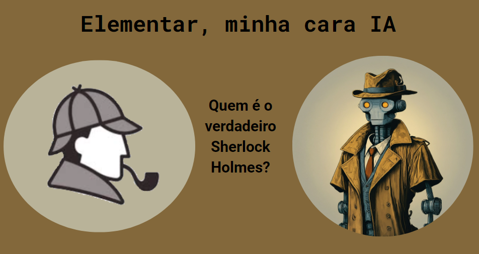

<p align="center">

</p>

```markdown
# Elementar, minha cara IA.

## 📒 Descrição
Este projeto consiste em um jogo de advinhação. No qual o participante deve comparar trechos reais das histórias de Sherlock Holmes com trechos gerados pela inteligência artificial do Google, a Gemini. Os trechos são aocmpanhados por imagens geradas pelo Gemini usando o próprio conteúdo do texto como prompt de comando.

## 🤖 Tecnologias Utilizadas
Google Gemini, Google Slides. 

## 🧐 Processo de Criação
Trechos dos seguintes livros foram usados: Um Estudo em Vermelho, O Cão dos Baskervilles, O Signo dos Quatro, O Vale da Morte. Após selecionar os trechos ideais para o desafio, utilizei cada trecho para gerar uma imagem dentro do Google Gemini para acompanhar os slides. Alguns textos, como os das 2 primeiras opções, não estavam ideais para a geração de imagem, nesse caso foram geradas imagens aleatórias de acordo com o tema do jogo. 

## 🚀 Resultados
O resultado é uma apresentação que pode ser aberta com o Google Slides, Microsoft PowerPoint ou outro progama semelhante. Pode até mesma ser salva localmente em PDF e acessada dessa forma. Cada slide consiste em um trecho ou deiretamente retirado das histórias de Sherlock Holmes ou gerado por IA. O objetivo é advinhar qual o verdadeiro. 

## 💭 Reflexão 
O maior desafio foi encontrar trechos que pudessem ser usados para a geração de conteúdo artificial. Os trechos não podem ser muito específicos, tornando a identificação muito fácil, nem muito complexos, dificultando a compreensão do leitor e a utilização como prompt pra IA. Algumas iterações foram necessárias para encontrar os trechos ideais. Outro ponto interessante foi o grau de liberdade dado à IA para gerar o conteúdo novo, as regras são mencionadas em detalhe nos prompts do projeto. Evitei usar muitas restrições e acredito que o resultado mostre o quão semelhante aos originais alguns textos são. 
```


